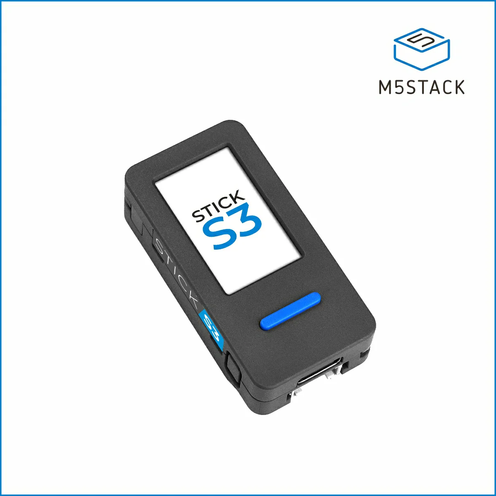
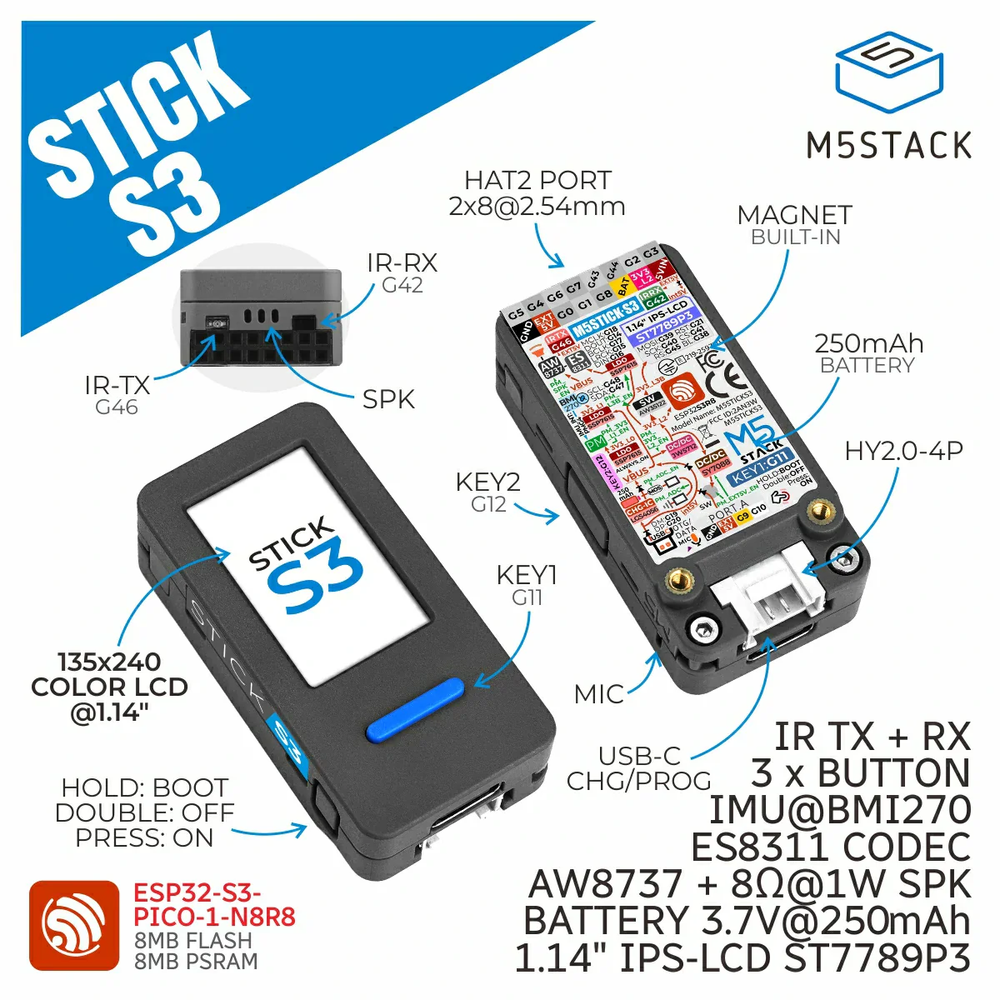
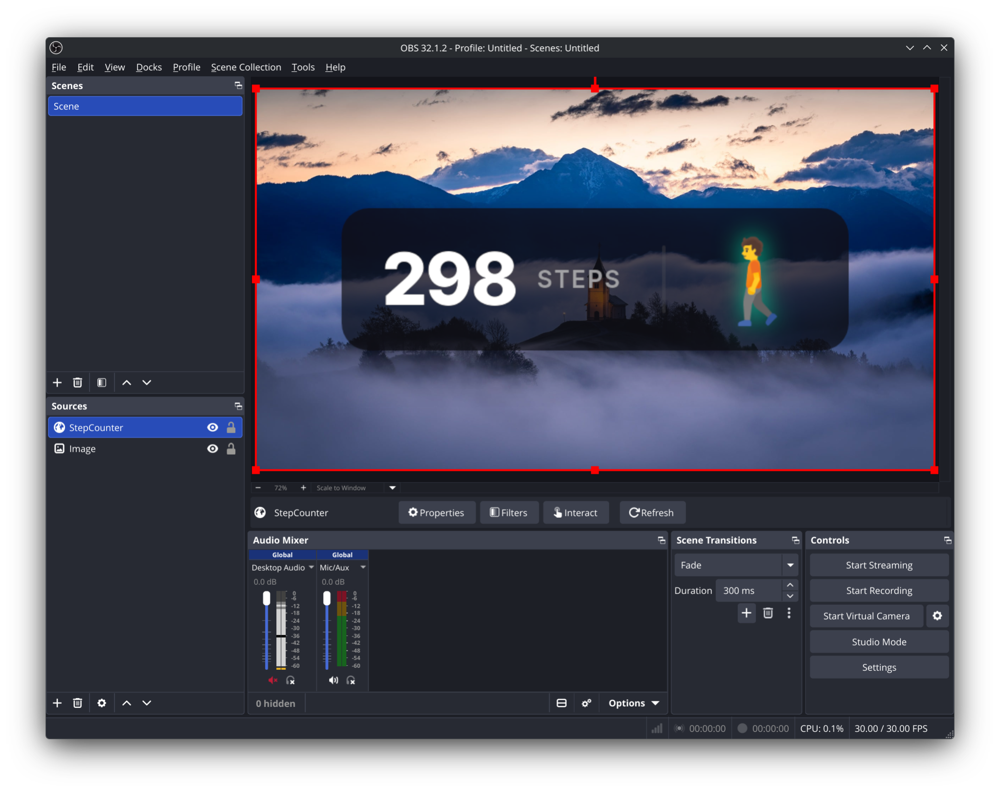

# 🦶 StepStick

**A plug-and-play, local-first pedometer overlay for live streamers.**

StepStick turns a $20 M5StickS3 development board into a real-time step counter for your stream. It requires no coding, no cloud accounts, and no third-party fitness apps. Just flash it from your browser, connect it to your Wi-Fi, and add it directly to OBS.

[**🌐 Visit the Web Installer & Documentation**](https://jhlwscom.github.io/stepstick/)

 

---

## ✨ Features

* **100% Local & Private:** Processes all movement data on the device and sends it directly to OBS over your local network. No telemetry, no subscriptions.
* **Native OBS Integration:** Runs an onboard web server. Add it to OBS as a standard Browser Source with zero delay.
* **Smart Activity Tracking:** Uses the BMI270 IMU to automatically detect whether you are standing still, walking, or running, updating the stream graphic instantly.
* **Browser Installation:** Uses `esp-web-tools` and the Improv Wi-Fi standard. Flash the firmware and connect to your network directly from Chrome or Edge via USB.
* **Stream-Ready Themes:** Customise colours, icons, and glow effects via the on-device web UI (`http://stepstick.local`) to match your branding.

---

## 🎮 For Streamers: Quick Start

You do not need to download any code to use StepStick. 

1. **Get the Hardware:** Purchase an **M5Stack StickS3** (ESP32-S3).
2. **Install the Software:** Plug the device into your PC via USB. Go to the [StepStick Web Installer](https://jhlwscom.github.io/stepstick/flash.html), and click "Install".
3. **Connect to Wi-Fi:** After installation, click "Configure Wi-Fi" in the browser prompt to securely connect the tracker to your home network.
4. **Add to OBS:** Navigate to `http://stepstick.local`, copy your overlay URL, and paste it as a **Browser Source** in OBS. 

For the complete setup guide, visit the [Setup Page](https://jhlwscom.github.io/stepstick/setup.html).

---

### Automated Dependency Management

This repository uses **Renovate** to strictly manage C++/Arduino library versions. All dependencies in `platformio.ini` are pinned by version tags, and `platformio.lock` enforces subresource integrity. PRs are grouped monthly after a 14-day community soak period to prevent supply chain attacks.

---

## AI Policy

A lot of this code is AI-generated. This was partly a learning project, for a software engineer to learn how to use AI tools to keep up with the quickly changing development landscape. All generated code was reviewed and understood before being committed.

**On art and icons:** No AI-generated art is included in this project. The overlay themes ship without bundled icons. If you are customising with your own icons, please hire a human artist.

---

